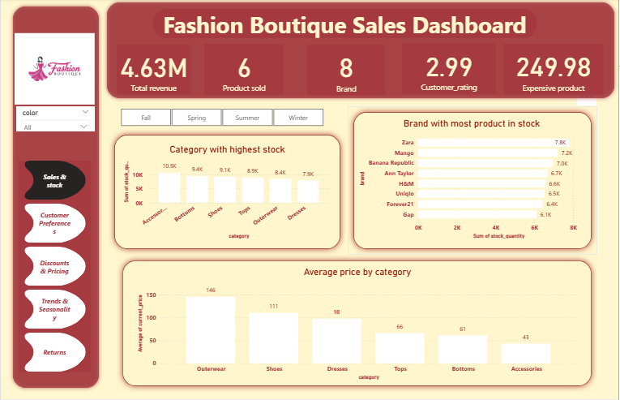
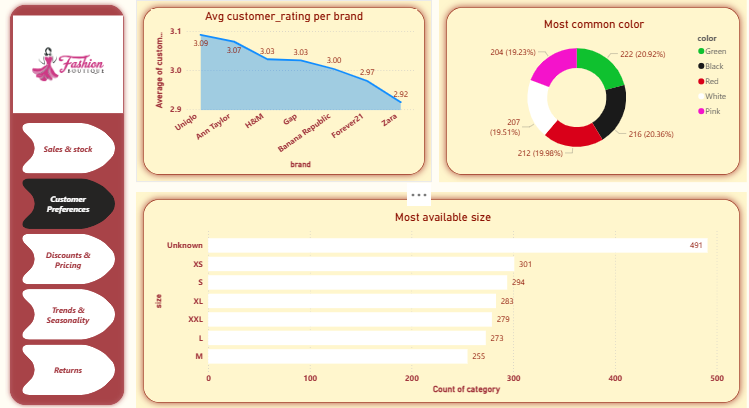
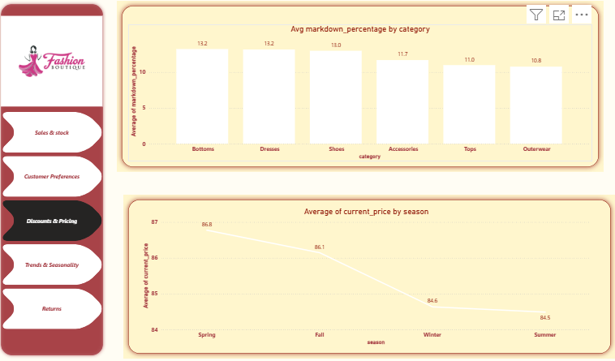
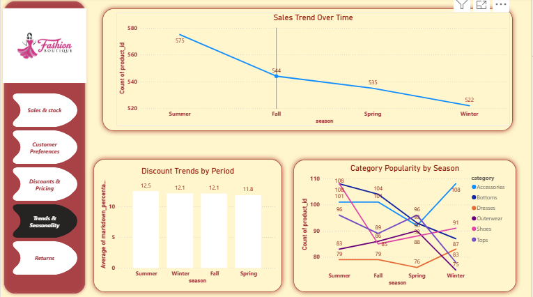
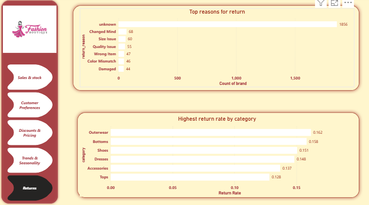

# Fashion_Bouquet
A sales analysis on a fashion bouquet dataset 
This project uses Power BI to analyze a fashion retail dataset, concentrating on sales, stock, customer preferences, pricing, discounts, and returns.  Finding important business insights that retailers can use to enhance customer satisfaction, optimize inventory, and improve pricing strategies is the aim.

# Details of the Dataset

 The dataset includes details about:

 Products: size, color, season, brand, and category

 Pricing: starting price, percentage of markdown, and current price

 Sales: total income, purchase date, and stock amount

 Reviews and ratings from customers

 Returns: the reason and status of the return

 # Key Insights

🛒 Stock & Sales

The items with the largest stock levels include shoes, tops, and outerwear.

Leading the overall inventory are Zara and Uniqlo, a sign of robust supply and high consumer demand.

The most expensive items on average are dresses and outerwear, whereas tops and accessories are less expensive.

Consumer Preferences 👥

Average customer ratings are higher for Gap and Mango.

Popular colors include blue, white, and black (traditional, adaptable options).

M, L, and XL are the most popular sizes; XS and XXL are underrepresented, indicating an inclusiveness gap.

Discounts and Prices

 Due to quick-changing fashion cycles, dresses and bottoms experience the highest markdown percentages.

 Seasonal pricing: Summer things are less expensive than winter and fall items.

 Returns

 Size problems and color mismatches are the main causes of returns.

 The most frequently returned items are dresses and accessories.

# Recommendations

 Stock Optimization → Reduce overstock in dresses and accessories by concentrating inventory on high-demand areas.

 Customer satisfaction → Expand XS/XXL selections and enhance sizing guidelines.

 Reevaluate pricing in trend-sensitive categories (e.g., dresses, bottoms) by using a markdown strategy.

 Quality & Returns → Tighter quality assurance and improved product image color accuracy.

 Brand Strategy → Emphasize Gap/Mango's good customer satisfaction ratings and reinforce Zara/Uniqlo's positioning

 ## 📊 Dashboard Preview

Here’s an overview of my 5-page Fashion Retail Power BI Dashboard:

### 🟠 Page 1: Sales & Stock Overview

### 🟢 Page 2: Customer Preferences

### 🔵 Page 3: Discounts & Pricing

### 🟣 Page 4: Trends & Seasonality    

### 🟤 Page 5: Summary & Key Insights

 
